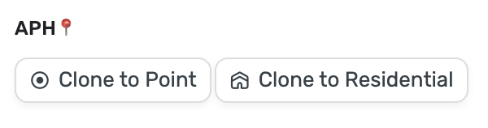
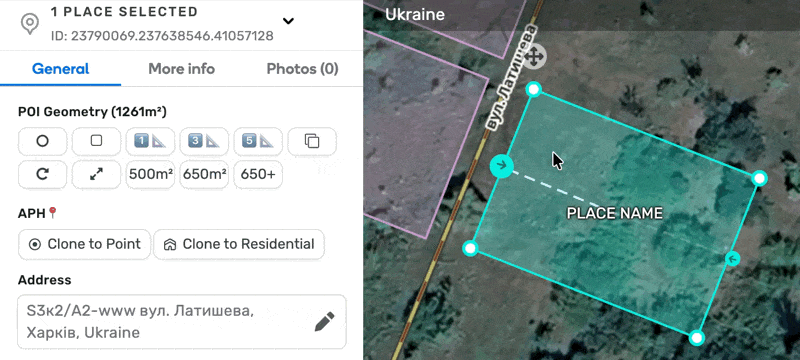
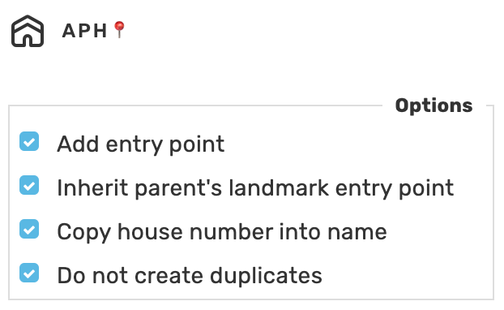

# WME Address Point Helper
This script helps to create point with the same address.

## Settings

## Shortcuts
<table style="width:100%">
<tr>
  <th>Shortcut</th>
  <th>Description</th>
</tr>
<tr>
<td align='center'><code>Alt</code>+<code>G</code></td>
<td>Create POI</td>
</tr>
<tr>
<td align='center'><code>Alt</code>+<code>H</code></td>
<td>Create Residential</td>
</tr>
</table>

## Links

Script homepage: https://github.com/waze-ua/wme-address-point-helper  
GreasyFork: https://greasyfork.org/en/scripts/45339-wme-address-point-helper
