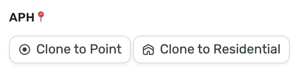
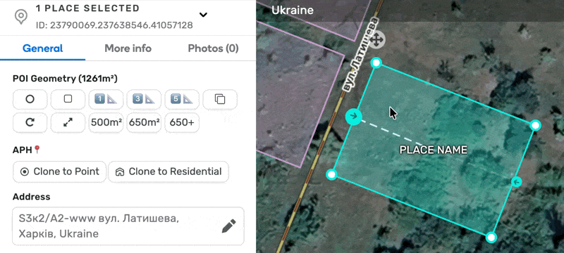
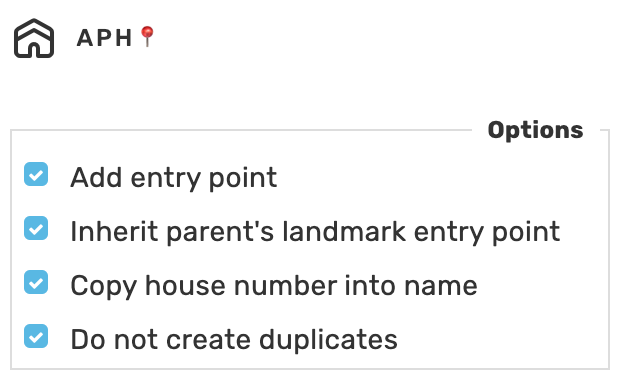

# WME Address Point Helper

A TamperMonkey/GreaseMonkey userscript for Waze Map Editor that creates address points (POI or Residential) from selected venues, cloning the address and optionally the entry point. Also provides keyboard shortcuts for quick venue drawing.





## Features

- Clone selected venue to a new Point POI with the same address
- Clone selected venue to a new Residential point
- Auto-detect and copy house number, street, and city
- Optionally copy house number into the point name
- Optionally inherit the entry point from the parent venue
- Duplicate detection — prevents creating points with the same address
- Quick draw shortcuts for placing venues on the map

## Settings



| Option                        | Description                                          |
|-------------------------------|------------------------------------------------------|
| Add entry point               | Create an entry point on the new POI                 |
| Inherit parent's entry point  | Copy the entry point from the source venue           |
| Copy house number into name   | Set the house number as the point name               |
| Do not create duplicates      | Skip if a point with the same address already exists |

## Shortcuts

| Shortcut    | Description                                   |
|-------------|-----------------------------------------------|
| `Alt+G`     | Clone to Point POI (requires venue selection)  |
| `Alt+H`     | Clone to Residential (requires venue selection)|
| `P`         | Draw Point — Other category                    |
| `Shift+L`   | Draw Area — Other category                     |
| `Shift+N`   | Draw Area — Natural Features                   |
| `Shift+P`   | Draw Area — Parking Lot                        |

The draw shortcuts trigger WME's native placement mode — press the shortcut, then click on the map to place the venue.

## Development

```bash
npm install
npm run build       # build dist/wme-address-point-helper.user.js
npm run watch       # rebuild on changes
```

### Project Structure

Source is written in TypeScript under `src/`, built with Rollup into a single IIFE at `dist/wme-address-point-helper.user.js`.

```
src/
  meta.ts          # userscript header
  style.css        # plain CSS
  globals.d.ts     # WME runtime globals
  name.ts          # script name constant
  translations.ts  # TRANSLATION (en, uk, ru)
  settings.ts      # SETTINGS defaults
  buttons.ts       # getButtons() — deferred button definitions
  aph.ts           # APH class (UI, shortcuts, validation)
  helpers.ts       # createPoint, createResidential, draw*, hasDuplicate
  index.ts         # bootstrap entry point
```

## @require Libraries

```javascript
// @require      https://update.greasyfork.org/scripts/389765/1794584/CommonUtils.js
// @require      https://update.greasyfork.org/scripts/450160/1792042/WME-Bootstrap.js
// @require      https://update.greasyfork.org/scripts/450221/1793261/WME-Base.js
// @require      https://update.greasyfork.org/scripts/450320/1794414/WME-UI.js
```

## Links

Script homepage: https://github.com/waze-ua/wme-address-point-helper  
GreasyFork: https://greasyfork.org/en/scripts/45339-wme-address-point-helper  
